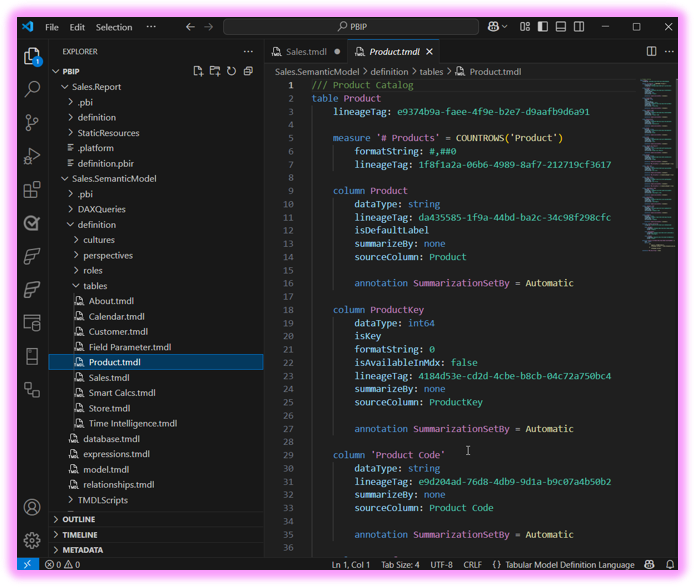

# TMDL Extension for Visual Studio Code

## Overview
A [Visual Studio Code extension](https://marketplace.visualstudio.com/items?itemName=analysis-services.TMDL) that adds language support for the Tabular Model Definition Language (TMDL), enabling developers to work directly with the code behind semantic models. 

> **Note:** This repository will eventually host the source code for the TMDL Language Extension.  
> For now, it serves only as a central location for tracking bugs and gathering feedback.
> This project is in Public Preview and implementation may significantly change prior to General Availability.

# Features

- **Semantic Highlighting**: Improves TMDL readability with context-aware coloring - see [Semantic Highlighting](#semantic-highlighting)  
- **Autocomplete**: Offers intelligent auto completion suggestions - see [Autocomplete](#autocomplete)
- **Error Diagnostics**: Highlights TMDL language errors - see [Error Diagnostics](#error-diagnostics)
- **Code Formatting**: Automatically organizes TMDL code - see [Code Formatting](#code-formatting)
- **Code Actions**: Provides quick fixes and refactoring options for common TMDL issues such as duplicated lineage tag or misspelled property- see [Code Actions](#code-actions)
- **Breadcrumbs**: Allow easy navigation within a TMDL document - see [Breadcrumbs](#breadcrumbs)
- **Hover Information**: Provides contextual information on mouse hover - see [Hover Information](#hover-information)

## 🚧 Coming soon
- **Find References** 
- **Context-Award Renaming** 
- **Context-Award Delete Action** 
- **Advanced Autocomplete** 

# Semantic Highlighting

Improves TMDL readability with context-aware syntax coloring

# Code Formatting

Automatically organizes TMDL code for enhanced readability and consistency along with enhanced formatting for embedded Power Query within TMDL with soon integration of DAX query formatting.

# Error Diagnostics

Identifies and highlights errors in TMDL code directly within the editor.
Also detects syntax issues in embedded Power Query, with DAX diagnostics support on the way.
Error messages are shown in the user's language based on locale settings.

> **Note:** Users must update their `locale` setting separately for Power Query in the VS Code extension to enable localization.

# Autocomplete

Provides smart, context-aware suggestions while editing TMDL documents.
Autocomplete support also includes embedded Power Query, and will soon expand to include DAX queries.
# Hover Information

Displays helpful contextual information when hovering over elements in TMDL documents.
Supports both TMDL and embedded Power Query, with future plans to support DAX as well.
# Code Actions

Offers quick fixes and refactoring suggestions for common TMDL issues. Examples include:
  1. Resolving duplicated lineage tags
  2. Correcting misspelled properties
  3. Adding missing syntax elements like colons, quotes, equal signs, etc.
And many more helpful fixes.
# Breadcrumbs

Allows easy navigation within a TMDL document showing the hierarchical structure of TMDL code

## Getting Started

### Prerequisites
1. Install either the stable or Insiders release of VS Code:
   * [💫 Stable release](https://code.visualstudio.com/download)
   * [🔮 Insiders release](https://code.visualstudio.com/insiders)
2. Install the [TMDL View VSCode Extension](https://marketplace.visualstudio.com/items?itemName=analysis-services.TMDL) extension
3. When you open TMDL documents with Visual Studio Code after setting up the extension, your TMDL documents will have syntax highlighting:

## Limitations

Currently, the extension on web supports only syntax highlighting. Additional features will be added in future releases.
The Power Query Autocomplete feature may occasionally display 'No suggestion' in uncommon scenarios.

## Documentation

* Learn more about TMDL from the [TMDL Docs](https://go.microsoft.com/fwlink/?linkid=2295924).
* Learn more about how to use TMDL with PBIP and Desktop Developer Mode from the [Developer Mode Docs](https://go.microsoft.com/fwlink/?linkid=2296020). 
* See our [blog post](https://go.microsoft.com/fwlink/?linkid=2296022) to learn more!

## Issues

Feedback is welcome and appreciated! If you come across an issue/bug with the extension or have a feature request, please [file an issue](https://github.com/microsoft/vscode-tmdl/issues). 

## Contributing

This project welcomes contributions and suggestions.  Most contributions require you to agree to a
Contributor License Agreement (CLA) declaring that you have the right to, and actually do, grant us
the rights to use your contribution. For details, visit https://cla.opensource.microsoft.com.

When you submit a pull request, a CLA bot will automatically determine whether you need to provide
a CLA and decorate the PR appropriately (e.g., status check, comment). Simply follow the instructions
provided by the bot. You will only need to do this once across all repos using our CLA.

This project has adopted the [Microsoft Open Source Code of Conduct](https://opensource.microsoft.com/codeofconduct/).
For more information see the [Code of Conduct FAQ](https://opensource.microsoft.com/codeofconduct/faq/) or
contact [opencode@microsoft.com](mailto:opencode@microsoft.com) with any additional questions or comments.

## Trademarks

This project may contain trademarks or logos for projects, products, or services. Authorized use of Microsoft 
trademarks or logos is subject to and must follow 
[Microsoft's Trademark & Brand Guidelines](https://www.microsoft.com/en-us/legal/intellectualproperty/trademarks/usage/general).
Use of Microsoft trademarks or logos in modified versions of this project must not cause confusion or imply Microsoft sponsorship.
Any use of third-party trademarks or logos are subject to those third-party's policies.
