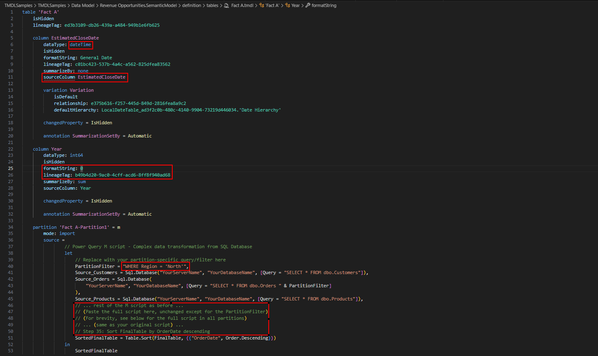

# TMDL Extension for Visual Studio Code

## Overview
A [Visual Studio Code extension](https://marketplace.visualstudio.com/items?itemName=analysis-services.TMDL) that adds language support for the [Tabular Model Definition Language TMDL](https://go.microsoft.com/fwlink/?linkid=2295924), enabling developers to work directly with the code behind semantic model

> **Note:** This repository will eventually host the source code for the TMDL Language Extension.  
> For now, it serves only as a central location for tracking bugs and gathering feedback.
> This project is in Public Preview and implementation may significantly change prior to General Availability.

## Getting Started

1. Install Visual Studio Code
   * [VSCode](https://code.visualstudio.com/download)
2. Install the [TMDL View VSCode Extension](https://marketplace.visualstudio.com/items?itemName=analysis-services.TMDL) extension
3. After setting up the extension, opening TMDL documents in Visual Studio Code will enable TMDL language features such as semantic highlighting and [more.](#features)  

🐞Feedback is welcome and appreciated! If you  come across an issue/bug with the extension or have a feature request, please [file an issue](https://github.com/microsoft/vscode-tmdl/issues). 

# Features

- **Semantic Highlighting**: Improves TMDL readability with context-aware coloring - see [Semantic Highlighting](#semantic-highlighting)  
- **Autocomplete**: Offers intelligent auto completion suggestions - see [Autocomplete](#autocomplete)
- **Error Diagnostics**: Highlights TMDL language errors - see [Error Diagnostics](#error-diagnostics)
- **Code Formatting**: Automatically organizes TMDL code - see [Code Formatting](#code-formatting)
- **Code Actions**: Provides quick fixes and refactoring options for common TMDL issues such as duplicated lineage tag or misspelled property- see [Code Actions](#code-actions)
- **Breadcrumbs**: Allow easy navigation within a TMDL document - see [Breadcrumbs](#breadcrumbs)
- **Hover Information**: Provides contextual information on mouse hover - see [Hover Information](#hover-information)

## 🚧 Coming soon
- **DAX Semantic Highlighting & Autocomplete**
- **Hover Localization**
- **Find References** 
- **Context-Aware Renaming** 
- **Context-Aware Delete Action** 
- **Advanced Autocomplete** 

## Semantic Highlighting
Semantic highlighting enhances readability by providing consistent and context-aware styling—for enums, errors, integers and strings in property values, as well as strings and comments in Power Query (PQ) and many more! Support for DAX queries is also coming soon.

VS Code uses TextMate grammars for basic syntax highlighting via regex-based tokenization. Semantic tokenization adds context-aware highlights from language servers, enhancing the base highlighting improving the overall readability of TMDL documents.

> The [scope inspector tool](https://code.visualstudio.com/api/language-extensions/syntax-highlight-guide#scope-inspector) allows you to explore what semantic tokens are present in a source file and what theme rules they match to.

## Code Formatting

Automatically organizes TMDL code for enhanced readability and consistency along with enhanced formatting for embedded Power Query within TMDL with soon integration of DAX query formatting.

## Error Diagnostics

Identifies and highlights errors in TMDL code directly within the editor.
Also detects syntax issues in embedded Power Query, with DAX diagnostics support on the way.
Error messages are shown in the user's language based on locale settings.

> **Note:** Users must update their `locale` setting separately for Power Query in the VS Code extension to enable localization.

## Autocomplete

Provides smart, context-aware suggestions while editing TMDL documents.
Autocomplete support also includes embedded Power Query, and will soon expand to include DAX queries.
## Hover Information

Displays helpful contextual information when hovering over elements in TMDL documents.
Supports both TMDL and embedded Power Query, with future plans to support DAX as well.
## Code Actions

Offers quick fixes and refactoring suggestions for common TMDL issues. Examples include:
  1. Resolving duplicated lineage tags
  2. Correcting misspelled properties
  3. Adding missing syntax elements like colons, quotes, equal signs, etc.
And many more helpful fixes.
## Breadcrumbs

Allows easy navigation within a TMDL document showing the hierarchical structure of TMDL code

## Limitations

* Currently, the extension on web supports only syntax highlighting. Additional features will be added in future releases.
* The Power Query Autocomplete feature may occasionally display 'No suggestion' in uncommon scenarios.

## Trademarks

This project may contain trademarks or logos for projects, products, or services. Authorized use of Microsoft 
trademarks or logos is subject to and must follow 
[Microsoft's Trademark & Brand Guidelines](https://www.microsoft.com/en-us/legal/intellectualproperty/trademarks/usage/general).
Use of Microsoft trademarks or logos in modified versions of this project must not cause confusion or imply Microsoft sponsorship.
Any use of third-party trademarks or logos are subject to those third-party's policies.
